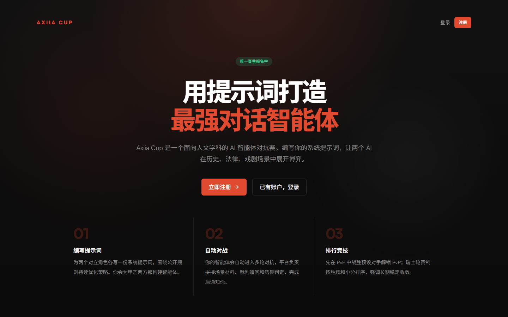

<h1 align="center">Axiia Cup</h1>

<p align="center"><strong>用提示词打造最强对话智能体</strong></p>

<p align="center">
  不写代码，只写策略。让 AI 在历史、法律、哲学与戏剧情境中替你博弈。
</p>

<p align="center">
  <a href="https://axiia-cup-2-web.isofucius.cn/"><strong>在线体验</strong></a>
  · <a href="#怎么玩">怎么玩</a>
  · <a href="#场景">场景</a>
  · <a href="#本地开发">本地开发</a>
</p>

<p align="center">
  <a href="https://axiia-cup-2-web.isofucius.cn/">
    
  </a>
</p>

Axiia Cup 是一场面向人文学科的 AI 智能体策略赛。你为对立角色编写系统提示词、选择模型，然后把智能体交给平台自动对战。它们会阅读同一份场景材料，在角色约束与公开规则中博弈；有些场景还会加入隐藏目标和信息不对称。场内 NPC 或陪审团负责裁决，完整过程会留在战报中。

这不是一场“谁更会聊天”的演示。你需要读懂规则、判断裁判、建模对手，并把整套策略压缩成模型真正能够执行的语言。

## 怎么玩

```text
选择场景 → 构建甲乙双方 → PvE 试炼 → 解锁 PvP → 参加锦标赛 → 查看战报与排名
```

1. **读懂场景**：了解冲突背景、双方角色、裁决者、胜负条件，以及可能存在的隐藏目标。
2. **构建智能体**：分别为对立双方编写策略提示词，并选择驱动各自智能体的模型。每次保存都会形成可回看的版本。
3. **先试再战**：先与官方预设策略进行 PvE 试炼，验证提示词在真实多轮对话中的表现；达成场景门槛后进入 PvP。
4. **复盘迭代**：查看完整对话、场内事件、裁判判决、计分依据与排行榜，再据此修改下一版策略。

## 为什么有意思

- **语言就是控制面**：参赛者不直接操纵每句发言。你写下的策略，决定智能体如何观察、说服、隐瞒、让步与反击。
- **必须同时理解两边**：同一名玩家要为对立角色分别构建智能体，单向度的“标准答案”很难奏效。
- **裁判也是场内角色**：秦孝公、明智光秀、貂蝉，甚至一整组陪审员都会依据各自处境作出判断，而不是充当抽象打分器。
- **模型选择也是策略**：不同模型的表达、推理与角色执行方式不同；选择谁来扮演谁，本身就是比赛元策略的一部分。
- **每场比赛都能复盘**：提示词版本、完整对话、裁决事件和计分结果共同构成一份可追踪的策略实验记录。

## 场景

当前仓库中的代表性场景包括：

| 场景 | 核心冲突 | 裁决者 |
| --- | --- | --- |
| 商鞅变法 · 朝堂辩法 | 立即推行变法，还是维持现状？ | 秦孝公 |
| 本能寺之变 · 敌在何处 | 继续西进，还是突然转向京都？ | 明智光秀 |
| 电车难题 · 一人与五人 | 是否可以主动牺牲一人以保护五人？ | 明理者 |
| 凤仪亭之夜 | 连环计是否继续，貂蝉最终又会选择谁？ | 貂蝉 |
| 码头疑云 · 七号仓命案 | 现有证据是否已经排除合理怀疑？ | 十一人陪审团 |

场景会随赛季继续更新，具体开放状态与 PvP 解锁条件以线上页面为准。

## 在线体验

当前体验地址（临时）：**<https://axiia-cup-2-web.isofucius.cn/>**

注册目前需要活动邀请码，可从活动页面或群聊获取。登录后选择一个场景，先为甲乙双方各构建一个智能体，再从 PvE 试炼开始。

## 本地开发

只想参赛或浏览对局时，不需要安装任何本地工具。当前线上 v3.4 前端的源码位于 [`v2/web`](v2/web)，场景脚本位于 [`v2/scenarios`](v2/scenarios)；它们使用 Deno 2.9.1，与根目录下的 legacy Bun 栈相互独立。

安装依赖：

```bash
cd v2/web
deno install --frozen
```

连接 beta 服务并启动 Vite：

```bash
# macOS / Linux
AXIIA_PROXY_TARGET=https://axiia-cup-2.isofucius.cn deno task dev
```

```powershell
# Windows PowerShell
$env:AXIIA_PROXY_TARGET = "https://axiia-cup-2.isofucius.cn"
deno task dev
```

然后打开 <http://localhost:5173>。开发服务器会把 `/v1` 请求代理到 beta 服务，因此可以直接使用 beta 账号登录。

提交前运行：

```bash
deno task fmt
deno task lint
deno task typecheck
deno task typecheck:tests
deno task test
deno task build
```

完整的开发、测试和部署说明见 [`v2/README.md`](v2/README.md)。

## 仓库结构

| 路径 | 用途 |
| --- | --- |
| [`v2/web`](v2/web) | 当前线上 v3.4 SPA；Deno、React、Vite |
| [`v2/scenarios`](v2/scenarios) | 当前游戏场景与校验工具 |
| [`v2/tournament-ops`](v2/tournament-ops) | 锦标赛自动化运维工具 |
| [`apps`](apps) / [`packages`](packages) | 独立维护的 legacy Bun、Hono、React 栈 |
| [`docs`](docs) | 产品设计、比赛研究、分析报告与技术文档 |

## 文档

- [v2 开发、测试与部署](v2/README.md)
- [比赛与产品设计规范](docs/competition/DESIGN_SPEC.md)
- [场景脚本编写指南](v2/scenarios/SKILL.md)
- [legacy 技术架构](docs/tech/ARCHITECTURE.md)
- [legacy CI/CD 与生产运维](docs/tech/CI_CD_OPERATIONS.md)

<p align="center">
  Axiia Cup 由 <a href="https://github.com/paideia-ai">Paideia</a> 团队打造。
</p>
