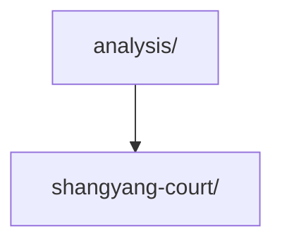

# docs/analysis/

Post-hoc analyses of tournament cohorts. Each scenario gets its own subdirectory.

## Files

| File / Folder | Description |
|---|---|
| `shangyang-court/` | Analyses of the 商鞅变法·朝堂辩法 cohort |

## Structure

