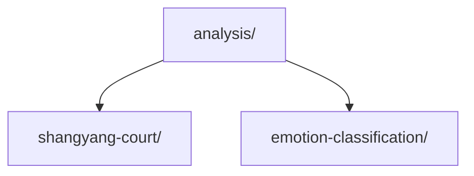

# docs/analysis/

Post-hoc analyses of tournament cohorts and cross-scenario model evaluations.

## Files

| File / Folder | Description |
|---|---|
| `shangyang-court/` | Analyses of the 商鞅变法·朝堂辩法 cohort |
| [emotion-classification/2026-09-27-astra-a66847a8/](emotion-classification/2026-09-27-astra-a66847a8/README.md) | Astra ten-class annotations for 642 complete outputs and the Jev experiment prompt |

## Structure

```mermaid
graph TD
    analysis["analysis/"]
    analysis --> shangyang["shangyang-court/"]
    analysis --> emotion["emotion-classification/"]
```
