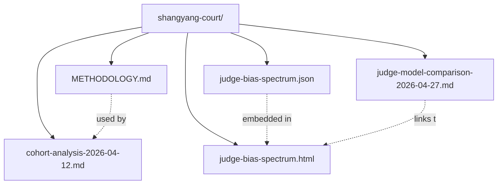

# docs/analysis/shangyang-court/

Analyses of the 商鞅变法·朝堂辩法 scenario cohort.

## Files

| File | Description |
|---|---|
| `METHODOLOGY.md` | The exact LLM prompt used for cohort analysis — Habermas's four validity claims + Searle's felicity conditions as the analytical backbone, with the game's structural facts (judge bias, scoring, 3-sentence constraint) inlined. Reproducible. |
| `cohort-analysis-2026-04-12.md` | First cohort analysis (17 participants, round 2 of 5). Anonymized public version — names and prompt verbatims removed; keeps aggregate patterns and 5 headline findings. |
| `judge-model-comparison-2026-04-27.md` | Controlled experiment: T8 top-5 matches re-judged across 8 judge LLMs (DS, Kimi, Qwen3.5/3.6, MiniMax, GLM-4.6, GPT-5.4, Claude Opus 4.5/4.6). Reform-rate spread: 0% (Opus 4.5) → 100% (Opus 4.6). |
| `judge-bias-spectrum.html` | Self-contained interactive viewer: bias spectrum (per-judge reform rate), per-match grid coloured by 变法/维持现状, click-to-inspect speech text. Open directly in browser. |
| `judge-bias-spectrum.json` | Compact data dump consumed by the HTML viewer: matches, players, DS reference judgments, per-judge {judgment, requests, speech} for all 8 matches × 7 new judges. |

## Structure

