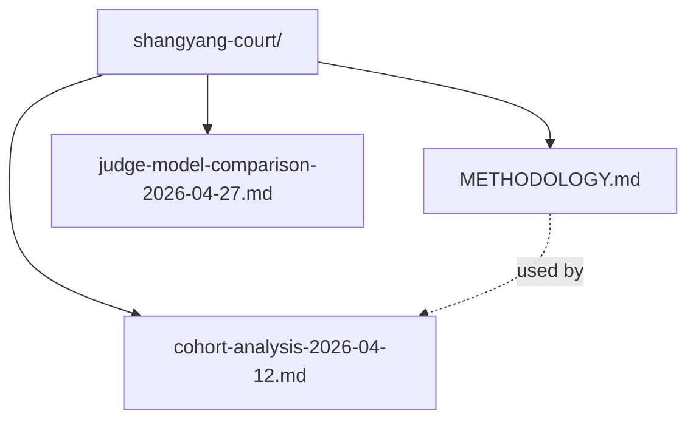

# docs/analysis/shangyang-court/

Analyses of the 商鞅变法·朝堂辩法 scenario cohort.

## Files

| File | Description |
|---|---|
| `METHODOLOGY.md` | The exact LLM prompt used for cohort analysis — Habermas's four validity claims + Searle's felicity conditions as the analytical backbone, with the game's structural facts (judge bias, scoring, 3-sentence constraint) inlined. Reproducible. |
| `cohort-analysis-2026-04-12.md` | First cohort analysis (17 participants, round 2 of 5). Anonymized public version — names and prompt verbatims removed; keeps aggregate patterns and 5 headline findings. |
| `judge-model-comparison-2026-04-27.md` | Controlled experiment: T8 top-5 matches re-judged with Kimi K2.5 vs original DeepSeek V3.2. Same transcripts, different judge. 6/8 agreement (75%), 2 flips. |

## Structure

