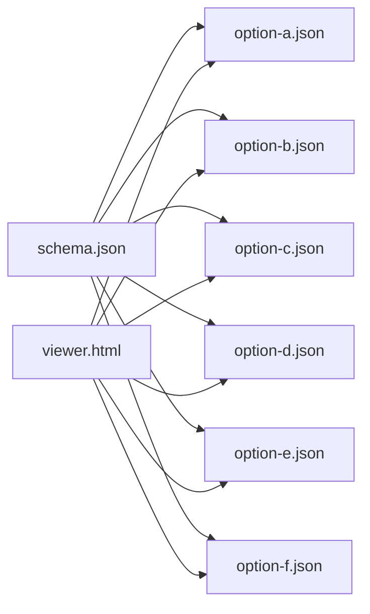

# Mock Runs

Simulated 10-round match transcripts for different Axiia Cup hidden-info design options. All files conform to `schema.json`.

| File | Description |
|------|-------------|
| `schema.json` | Unified JSON schema supporting all hidden info design options (A-F) |
| `option-a.json` | Option A "裁判实时反应" — Judge (秦孝公) participates live in 3-way dialogue with non-verbal reactions signaling true/false hidden info |
| `option-b.json` | Option B "隐藏小目标" — 2-player debate where each side secretly pushes one true sub-goal among decoys; post-game judge rules on each |
| `option-c.json` | Option C "可观测异常" — Observable anomaly forces engagement; each player has 3 hidden goals (1 active), post-game 3D evaluation (achievement, detection, quality) |
| `option-d.json` | Option D "传闻+异议系统" — Judge announces rumors one by one, targets respond, opponents may object; tests information warfare under pressure |
| `option-e.json` | Option E "纯辩论" (Pure Debate) — Simplest option with no hidden info; pure 2-player debate where 秦孝公 evaluates persuasiveness, historical knowledge, and logic post-game; winner takes 1 point |
| `option-f.json` | Option F "赛后猜测" (Post-Game Guessing) — Simon's PvP design with 2T1F hidden info and public demands but no forcing mechanism; demonstrates the "silence is optimal" problem where hidden info goes unused; post-game demand decisions + info guessing |
| `viewer.html` | HTML viewer for rendering mock run JSON files |

