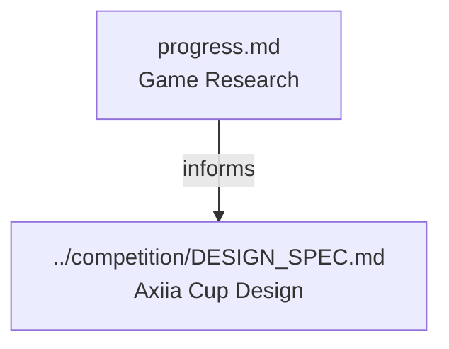

# docs/game-research/

Game design research exploring historical great games for mechanisms and insights that can inform Axiia Cup's competitive prompt-engineering-via-dialogue format.

## Files

| File                       | Description                                                                    |
| -------------------------- | ------------------------------------------------------------------------------ |
| [progress.md](progress.md) | Main research document: game analyses, design principles, and research backlog |

