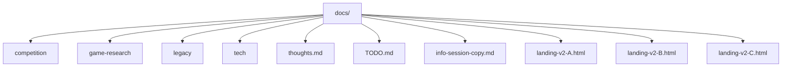

# docs/

Documentation and design assets for the Axiia Cup project.

## Files

| File / Folder | Description |
|---|---|
| `competition/` | Competition design specifications and rules |
| `game-research/` | Game research analysis and design principles |
| `legacy/` | Historical/superseded design documents |
| `tech/` | Technical architecture and implementation docs |
| `thoughts.md` | Running log of inspirations, ideas, and design notes |
| `TODO.md` | Project task tracking |
| `info-session-copy.md` | WeChat recruitment copy for Apr 9 info session (student + coworker versions) |
| `landing-v2-A.html` | Variant A landing page ("Court Showdown") -- cinematic fighting-game VS screen style, full Chinese, dark theme with coral-red accent |
| `landing-v2-B.html` | Variant B landing page ("Secret Scroll") -- imperial scroll/dossier style with classified document reveals, ancient texture overlays, wax seal buttons, and narrative-driven sections |
| `landing-v2-C.html` | Variant C landing page ("Player Recruitment") -- esports tournament recruitment poster style with glitch effects, neon accents, and dual-track recruitment cards |

## Structure

