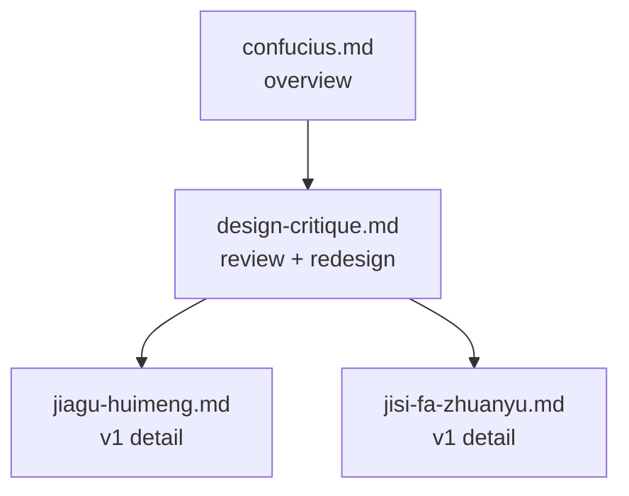

# 济宁孔子主题剧本索引

本目录用于整理 Axiia Cup 中与孔子、鲁国故地和济宁文化圈相关的历史辩论场景。

- [confucius.md](./confucius.md) — 孔子相关辩论场景的初步盘点，作为主题 overview。
- [jiagu-huimeng.md](./jiagu-huimeng.md) — 夹谷会盟剧本筹划 v1，聚焦孔子以礼法与武备反制齐国劫盟（待按 design-critique 重写）。
- [jisi-fa-zhuanyu.md](./jisi-fa-zhuanyu.md) — 季氏将伐颛臾剧本筹划 v1，聚焦鲁国内部权斗、名分与私门兵权（待按 design-critique 重写）。
- [design-critique.md](./design-critique.md) — 12 场景逐一评估 + 两份 v1 剧本的批评与重构方案。

