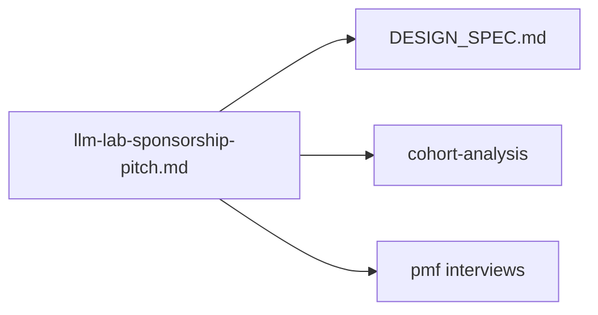

# docs/pitch/

Pitch materials and partnership proposals for Axiia Cup.

## Files

- **llm-lab-sponsorship-pitch.md** — Pitch to LLM labs for sponsoring Axiia Cup token usage. Covers engagement data, talent signal, leaderboard branding, data value, and judge bias benchmark.
- **llm-lab-sponsorship-pitch-zh.md** — Chinese version of the LLM sponsorship pitch (中文版).
- **llm-sponsorship-deck-zh.html** — Reveal.js slide deck (17 slides, Chinese). Open in browser to present.
- **screenshots/** — Playwright-generated screenshots of each slide for visual QA.

