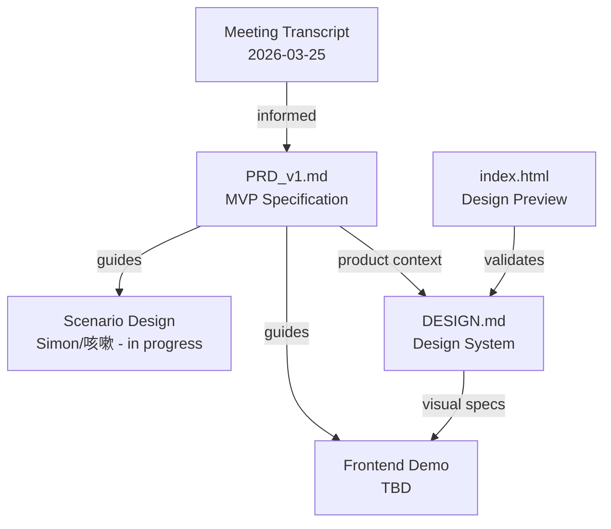

# axiia-cup/

Axiia Cup agent competition platform — design documents and specifications.

## Files

- [PRD_v1.md](PRD_v1.md) — Product requirements document v1: full MVP spec, decision log, deferred questions, and competitive positioning. Based on 2026-03-25 meeting + 2026-03-29 design decisions.
- [DESIGN.md](DESIGN.md) — Design system: editorial aesthetic, Fraunces + Noto Sans SC typography, vermilion accent #C23B22, full color/spacing/motion specs, Chinese UI terminology.
- [index.html](index.html) — Interactive design preview: font specimens, color palette, component library, and 3 screen mockups (leaderboard, agent builder, match result) with light/dark toggle.

## Relationships

