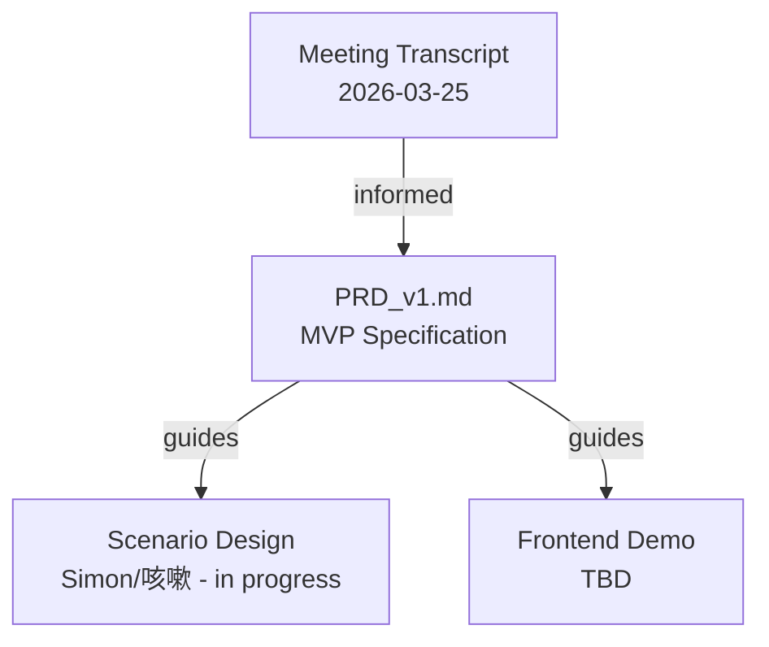

# axiia-cup/

Axiia Cup agent competition platform — design documents and specifications.

## Files

- [PRD_v1.md](PRD_v1.md) — Product requirements document v1: full MVP spec, decision log, deferred questions, and competitive positioning. Based on 2026-03-25 meeting + 2026-03-29 design decisions.

## Relationships

