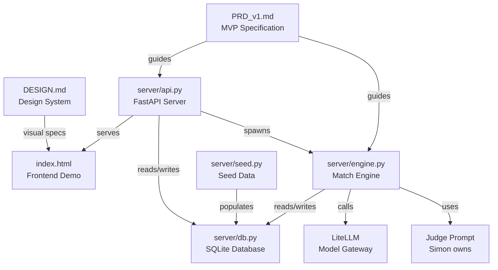

# axiia-cup/

Axiia Cup agent competition platform — design documents, frontend demo, and backend server.

## Files

- [PRD_v1.md](PRD_v1.md) — Product requirements document v1: full MVP spec, decision log, deferred questions. Includes autoplan review (CEO + Design + Eng).
- [DESIGN.md](DESIGN.md) — Design system: dark dashboard aesthetic, Satoshi + Noto Sans SC, vermilion accent #E04A2F, Chinese UI terminology.
- [index.html](index.html) — Interactive frontend demo: 6 screens (landing, dashboard, builder, playground, leaderboard, match result) + design system showcase.
- [server/](server/) — Python backend (FastAPI + SQLite + LiteLLM):
  - `db.py` — Database layer: users, scenarios, submissions, matches, leaderboard
  - `engine.py` — Match engine: 20-turn dialogue runner + 3x judge majority vote
  - `api.py` — REST API with background match worker
  - `seed.py` — Seed script: Columbus scenario + 5 test users

## Running

```bash
uv run python -m server.seed        # seed database
uv run uvicorn server.api:app       # start server at localhost:8000
```

## Relationships


