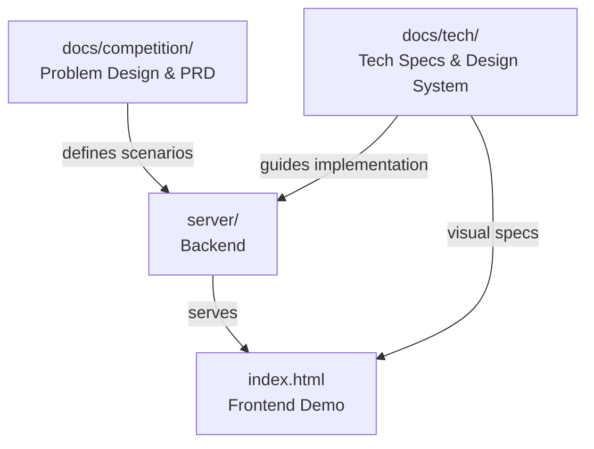

# axiia-cup/

Axiia Cup agent competition platform — design documents, frontend demo, and backend server.

## Structure

- [docs/competition/](docs/competition/) — Competition design: PRD, problem scenarios, event materials
- [docs/tech/](docs/tech/) — Tech specs: design system, judge spec, API mock data
- [server/](server/) — Python backend (FastAPI + SQLite): db, match engine, API, seed
- [index.html](index.html) — Interactive frontend demo (6 screens + design system showcase)
- [app.html](app.html) — Earlier frontend prototype

## Deployment

- [Dockerfile](Dockerfile) — Container config for Fly.io
- [fly.toml](fly.toml) — Fly.io app config

## Running

```bash
uv run python -m server.seed        # seed database
uv run uvicorn server.api:app       # start server at localhost:8000
```

## Relationships


