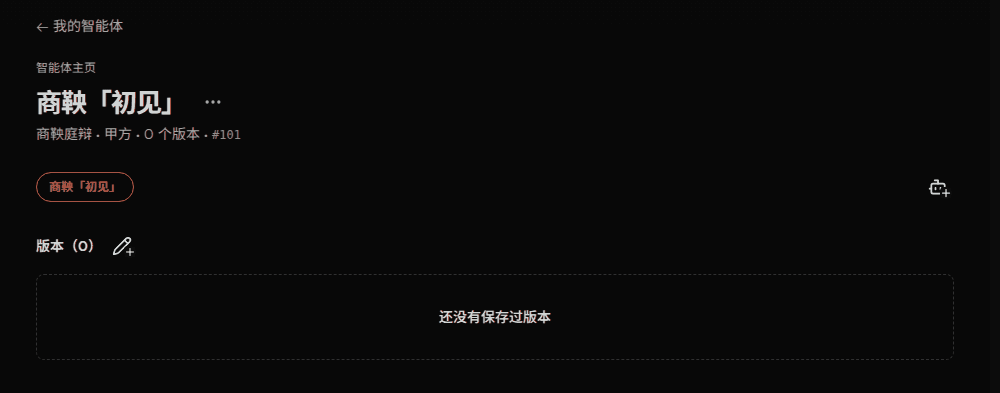

# 智能体主页首次操作动效预览

正式方案为 A「明亮涟漪」。预览复用实际页面和按钮，支持切换模拟进度。
其余候选效果已移除。



- 铅笔：当前智能体尚无已保存版本且未归档时播放。
- 机器人：清单加载成功且无刷新错误、同场景同角色仅有一个智能体且唯一智能体就是当前智能体且未归档时播放。
  计数包含已归档智能体，归档第二个不会重新触发首次引导。
- 周期 2.8 秒，机器人延后 0.9
  秒；扩散至约三倍尺寸，图标同步亮起；减少动态效果和强制色彩模式禁用动效。
- 预览数据由 MSW 提供，不连接线上账户。状态开关可分别模拟完成两项操作。
  机器人支持在预览内创建第二个智能体；铅笔打开说明页，不提供完整构建器。

从 `v2/web` 运行：

```sh
deno run -A npm:vite --config preview/agent-motion/vite.config.ts --port 5242
deno run -A npm:vite build --config preview/agent-motion/vite.config.ts
```

静态输出位于 `build/agent-motion-preview`。部署时保留
`mockServiceWorker.js`，并将页面路由回退到 `index.html`。
